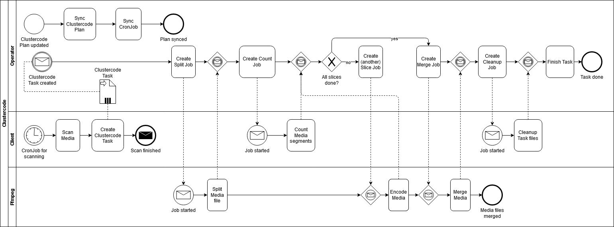

# clustercode

[][build]


[][releases]
[][codeclimate]
[][releases]
[][dockerhub]
[][license]

Automatically convert your movies and TV shows from one file format to another using ffmpeg in a cluster.
It's like an Ffmpeg operator.

## How it works

Clustercode reads an input file from a directory and splits it into multiple smaller chunks.
Those chunks are encoded individually, but in parallel when enabling concurrency.
That means, more nodes equals faster encoding.
After all chunks are converted, they are merged together again and put into target directory.

Ffmpeg is used in the splitting, encoding and merging jobs.
It basically boils down to

1. Splitting: `ffmpeg -i movie.mp4 -c copy -map 0 -segment_time 120 -f segment job-id_%d.mp4`
2. Encoding: `ffmpeg -i job-id_1.mp4 -c:v copy -c:a copy job-id_1_done.mkv`
3. Merging: `ffmpeg -f concat -i file-list.txt -c copy movie_out.mkv`

The encoding step can be executed in parallel by multiple Pods.
You can customize the arguments passed to ffmpeg (with a few rules and constraints).

Under the hood, only 2 Kubernetes CRDs are used to describe the config.
All steps with Ffmpeg are executed with Kubernetes Jobs.

Clustercode operates in either in "operator" or "client" mode.
As an operator, clustercode "translates" Clustercode Plans into Tasks, which in turn control the spawning CronJobs and Jobs.
There is only one operator on the cluster across all namespaces.
In Jobs and CronJobs, Clustercode is launched as a client, interacting with Kubernetes API.
CronJobs and Jobs are launched in the same namespace as the ClusterCode plan is in.



## Features

* Scans and encodes video files from a directory and encodes them using customizable plans.
* Encoded files are stored in an output directory.
* Schedule Scans for new files with Cron.
* Take advantage of having multiple computers: Each Pod encodes a segment, enabling parallelization.
* Works on single nodes too, but you might not get any speed benefits (in fact it's generating overhead).

## Installation

Currently, there is Kustomize support. Helm is planned.
Install with `kustomize build config/default | kubectl apply -f -`.

## Supported storage types

All file-writable ReadWriteMany volumes available in Kubernetes PersistentVolumeClaims.

## Configuration

```yaml
apiVersion: clustercode.github.io/v1alpha1
kind: ClustercodePlan
metadata:
  name: test-plan
spec:
  scanSchedule: "*/30 * * * *"
  storage:
    sourcePvc:
      claimName: my-nfs-source
      #subPath: source
    intermediatePvc:
      claimName: some-other-storage-claim
      #subPath: intermediate
    targetPvc:
      claimName: my-nfs-target
      #subPath: target
  scanSpec:
    mediaFileExtensions:
      - mp4
  taskConcurrencyStrategy:
    concurrentCountStrategy:
      maxCount: 1
  encodeSpec:
    sliceSize: 120 # after how many seconds to split
    defaultCommandArgs: ["-y","-hide_banner","-nostats"]
    splitCommandArgs:
      - -i
      - ${INPUT}
      - -c
      - copy
      - -map
      - "0"
      - -segment_time
      - ${SLICE_SIZE}
      - -f
      - segment
      - ${OUTPUT}
    transcodeCommandArgs:
      - -i
      - ${INPUT}
      - -c:v
      - copy
      - -c:a
      - copy
      - ${OUTPUT}
    mergeCommandArgs:
      - -f
      - concat
      - -safe
      - "0"
      - -i
      - ${INPUT}
      - -c
      - copy
      - ${OUTPUT}
```

## Project status

Clustercode 2.0 is released **as a Proof-of-concept** and no new changes will be made to old [1.3 release](https://github.com/ccremer/clustercode/tree/1.3.1).

The code is ugly, documentation inexistent and only the Happy Path works.
But feel free to try "early access" and report stuff.

## Docker Tags

* master: Floating image tag that points to the image built from master branch, usually unreleased changes.
* latest: Floating image tag that points to the latest stable release
* tagged: tags following the x.y.z pattern are specific releases

[build]: https://github.com/ccremer/clustercode/actions?query=workflow%3ABuild
[releases]: https://github.com/ccremer/clustercode/releases
[license]: https://github.com/ccremer/clustercode/blob/master/LICENSE
[dockerhub]: https://hub.docker.com/r/ccremer/clustercode
[codeclimate]: https://codeclimate.com/github/ccremer/clustercode
